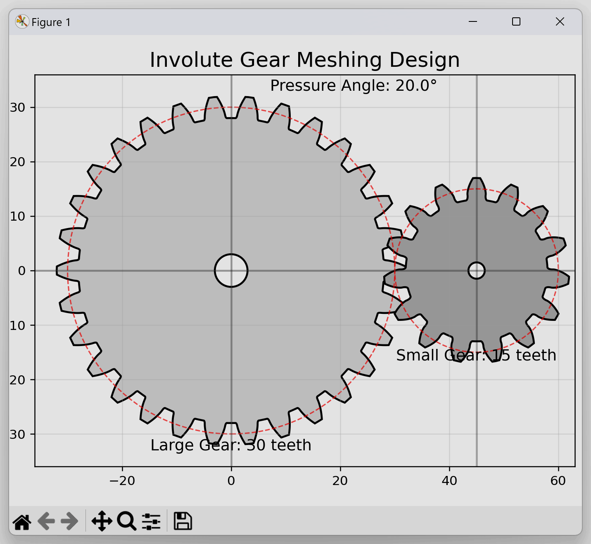

# gear_generator.py

Gear generator using [gear-profile-generator](https://github.com/leventelist/gear-profile-generator/tree/python3_support).



## Usage

```bash
$ pip install -r requirements.txt
$ python gear_generator.py # show OpenCV window
$ python gear_generator.py --save gears.svg # save SVG file
```